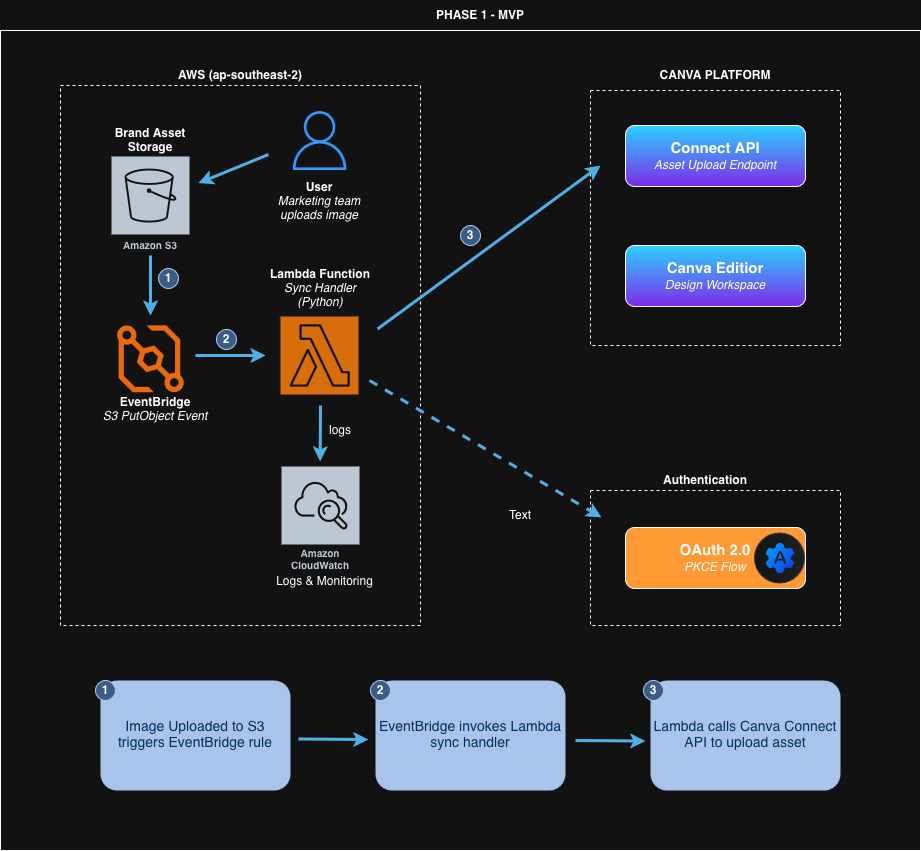
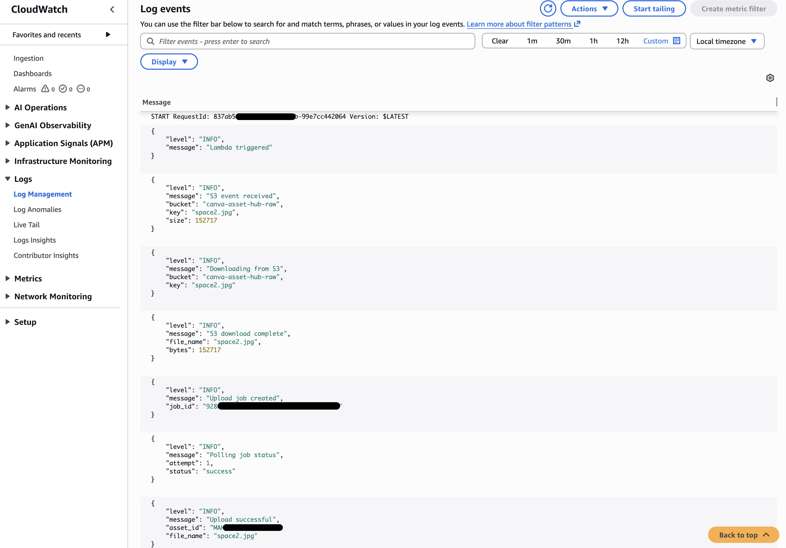
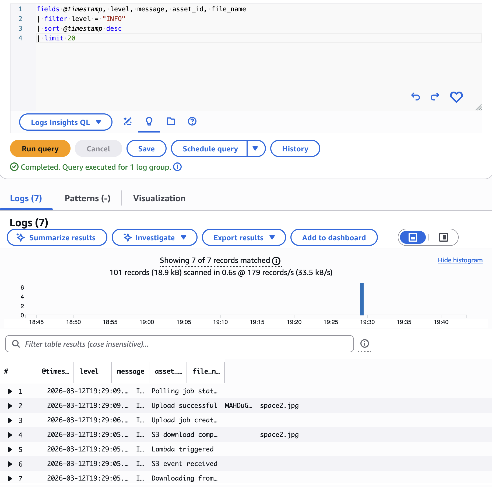

# Canva Asset Hub

> Event-driven integration between AWS S3 and Canva Connect API — automating brand asset synchronisation for enterprise marketing teams.

## Overview

Large marketing teams manage thousands of approved brand assets in AWS S3. Previously, uploading these assets to Canva required manual downloads and re-uploads — a repetitive, error-prone process.

**Canva Asset Hub** eliminates that entirely. When an image is uploaded to S3, an event-driven pipeline automatically syncs it to Canva — no human intervention required.

## Website

[Website Link](https://jay-yoon10.github.io/canva-asset-hub/)

## Architecture



### How it works (Phase 1)

1. A brand asset (PNG/JPG) is uploaded to the S3 bucket
2. S3 emits an `Object Created` event to Amazon EventBridge
3. EventBridge rule triggers the Lambda function
4. Lambda downloads the file from S3 and calls the Canva Asset Upload API
5. Lambda polls the async job until upload is confirmed
6. Asset is live in the Canva Brand Kit

## Tech Stack

| Layer | Service |
|-------|---------|
| Storage | Amazon S3 |
| Event routing | Amazon EventBridge |
| Compute | AWS Lambda (Python 3.12) |
| API integration | Canva Connect API (OAuth 2.0 PKCE) |
| Observability | Amazon CloudWatch (structured JSON logging) |

## Project Structure
```
canva-asset-hub/
├── lambda/
│   └── upload_handler/
│       └── lambda_function.py   # Core Lambda handler
├── docs/
│   └── architecture.png         # Architecture diagram
├── .env.example                 # Environment variable template
└── README.md
```
## Setup Guide

### Prerequisites
- AWS account with S3, Lambda, EventBridge, CloudWatch access
- Canva Developer account — [canva.dev](https://canva.dev)
- Canva integration with `asset:write` scope enabled

### 1. S3 Bucket
```bash
# Create bucket (replace with your preferred name)
aws s3 mb s3://canva-asset-hub-raw --region ap-southeast-2

# Enable EventBridge notifications
aws s3api put-bucket-notification-configuration \
  --bucket canva-asset-hub-raw \
  --notification-configuration '{"EventBridgeConfiguration": {}}'
```

### 2. Lambda Function
- Runtime: Python 3.14
- Timeout: 60+ seconds
- Memory: 256 MB
- IAM role: `AmazonS3ReadOnlyAccess` + `CloudWatchLogsFullAccess`

### 3. Environment Variables
```bash
CANVA_ACCESS_TOKEN=your_canva_access_token_here
CANVA_API_BASE=https://api.canva.com/rest/v1
```

Copy `.env.example` and fill in your values. Never commit `.env` to version control.

### 4. EventBridge Rule

Event pattern:
```json
{
  "source": ["aws.s3"],
  "detail-type": ["Object Created"],
  "detail": {
    "bucket": { "name": ["canva-asset-hub-raw"] },
    "object": {
      "key": [
        { "suffix": ".png" },
        { "suffix": ".jpg" },
        { "suffix": ".jpeg" }
      ]
    }
  }
}
```

Target: Lambda function `canva-asset-upload-handler`

## Key Design Decisions

**Why EventBridge instead of S3 direct trigger?**
EventBridge provides a decoupled, filterable event bus. The suffix filter (`.png`, `.jpg`) ensures Lambda is only invoked for supported file types — avoiding unnecessary executions for other file types uploaded to the same bucket.

**Why async polling for Canva uploads?**
Canva's Asset Upload API is asynchronous by design — it returns a job ID immediately and processes the upload in the background. Lambda polls the job status every 3 seconds (up to 10 attempts) before confirming success.

**Why structured JSON logging?**
All logs use a consistent `{"level": "INFO/WARN/ERROR", "message": "...", ...}` format, enabling CloudWatch Logs Insights queries like `filter level = "ERROR"` for fast incident detection.

## Observability
CloudWatch Logs successful uploads



CloudWatch Logs Insights query for successful uploads:

fields @timestamp, level, message, asset_id, file_name
| filter message = "Upload successful"
| sort @timestamp desc



## Roadmap

### Phase 2 (Planned)
- [ ] Reverse sync — Canva Webhook → Lambda → S3 (export published designs back to S3)
- [ ] Amazon Bedrock AI tagging — generate business-context metadata before upload (`brand_tier`, `campaign_type`, `approved_for`)
- [ ] DynamoDB — store asset metadata and sync state (S3 key ↔ Canva Asset ID mapping)
- [ ] API Gateway + Amazon Cognito — REST API with JWT authentication
- [ ] React dashboard — sync status, logs, manual trigger UI

### Future Enhancements
- Microsoft Entra ID integration (Enterprise SSO, multi-cloud identity)
- Multi-platform support (S3 → Figma, S3 → Adobe)

## Author

**Jay (Yeojoon) Yoon** — Cloud Engineer
[LinkedIn](https://www.linkedin.com/in/jay-yoon-0294801b1/) · [GitHub](https://github.com/Jay-yoon10)

> *Built as a portfolio project.*
> *Views are my own and not those of my employer.*
