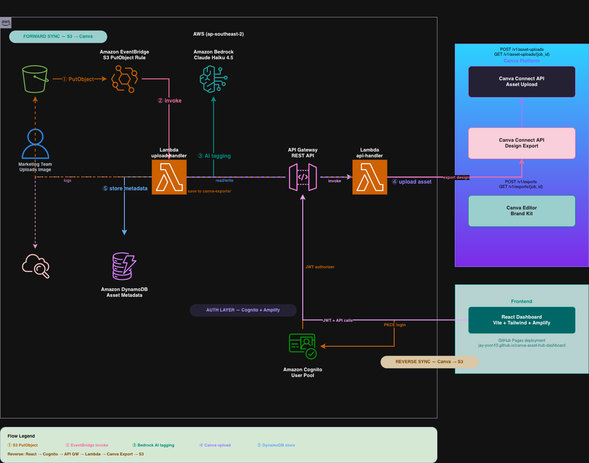

# Canva Asset Hub

> Event-driven integration between AWS S3 and Canva Connect API — automating brand asset synchronisation for enterprise marketing teams.

## Overview

Large marketing teams manage thousands of approved brand assets in AWS S3. Previously, uploading these assets to Canva required manual downloads and re-uploads — a repetitive, error-prone process.

**Canva Asset Hub** eliminates that entirely. When an image is uploaded to S3, an event-driven pipeline automatically syncs it to Canva — with AI-generated business-context tags, a REST API for manual control, and a React dashboard for full visibility.

## Website & Dashboard


| Link                                                                      | Description                                     |
| ------------------------------------------------------------------------- | ----------------------------------------------- |
| [Portfolio Site](https://jay-yoon10.github.io/canva-asset-hub/)           | Project documentation and architecture overview |
| [Live Dashboard](https://jay-yoon10.github.io/canva-asset-hub-dashboard/) | React dashboard — login required (Cognito)      |


---

## Architecture

### Phase 1 — MVP

Phase 1 Architecture

```
S3 Upload → EventBridge → Lambda → Canva Connect API → CloudWatch
```

1. A brand asset (PNG/JPG) is uploaded to the S3 bucket
2. S3 emits an `Object Created` event to Amazon EventBridge
3. EventBridge rule triggers the Lambda function
4. Lambda downloads the file from S3 and calls the Canva Asset Upload API
5. Lambda polls the async job until upload is confirmed
6. Asset is live in the Canva Brand Kit

### Phase 2 — Full Pipeline

Phase 2 Architecture

```
Forward:  S3 → EventBridge → Lambda → Bedrock (AI tagging) → Canva API → DynamoDB
Reverse:  React Dashboard → API Gateway (JWT) → Lambda → Canva Export → S3
Auth:     React → Amplify (PKCE) → Cognito → JWT → API Gateway
```

---

## Tech Stack


| Layer           | Service                                     |
| --------------- | ------------------------------------------- |
| Storage         | Amazon S3                                   |
| Event routing   | Amazon EventBridge                          |
| Compute         | AWS Lambda (Python 3.12)                    |
| AI tagging      | Amazon Bedrock (Claude Haiku 4.5)           |
| Metadata store  | Amazon DynamoDB                             |
| REST API        | Amazon API Gateway                          |
| Authentication  | Amazon Cognito (OAuth 2.0 PKCE)             |
| API integration | Canva Connect API                           |
| Frontend        | React (Vite + Tailwind + Amplify)           |
| Observability   | Amazon CloudWatch (structured JSON logging) |


---

## Project Structure

```
canva-asset-hub/
├── lambda/
│   ├── upload_handler/
│   │   └── lambda_function.py   # S3 → Bedrock → Canva pipeline
│   └── api_handler/
│       └── lambda_function.py   # REST API handler (API Gateway)
├── scripts/
│   └── backfill.py              # Backfill existing S3 assets to DynamoDB
├── assets/                      # Architecture diagrams + screenshots
├── docs/                        # GitHub Pages (portfolio site)
├── .env.example                 # Environment variable template
└── README.md
```

---

## Setup Guide

### Prerequisites

- AWS account with S3, Lambda, EventBridge, DynamoDB, API Gateway, Cognito, CloudWatch, Bedrock access
- Canva Developer account — [canva.dev](https://canva.dev)
- Canva integration with `asset:write` scope enabled
- Node.js 18+ (for frontend)

### 1. S3 Bucket

```bash
aws s3 mb s3://canva-asset-hub-raw --region ap-southeast-2

aws s3api put-bucket-notification-configuration \
  --bucket canva-asset-hub-raw \
  --notification-configuration '{"EventBridgeConfiguration": {}}'
```

### 2. Lambda — Upload Handler (`canva-asset-upload-handler`)

- Runtime: Python 3.12
- Timeout: 120 seconds
- Memory: 256 MB
- IAM: `AmazonS3ReadOnlyAccess` + `AmazonDynamoDBFullAccess` + `AmazonBedrockFullAccess` + `CloudWatchLogsFullAccess`

Environment variables:

```bash
CANVA_ACCESS_TOKEN=your_canva_access_token_here
CANVA_API_BASE=https://api.canva.com/rest/v1
DYNAMODB_TABLE=canva-asset-hub-assets
BEDROCK_MODEL_ID=anthropic.claude-haiku-4-5
BEDROCK_REGION=ap-southeast-2
```

### 3. Lambda — API Handler (`canva-asset-hub-api`)

- Runtime: Python 3.12
- Timeout: 120 seconds
- Memory: 256 MB
- IAM: `AmazonDynamoDBFullAccess` + `AmazonS3FullAccess` + Lambda invoke permission for `canva-asset-upload-handler`

Environment variables:

```bash
DYNAMODB_TABLE=canva-asset-hub-assets
CANVA_ACCESS_TOKEN=your_canva_access_token_here
CANVA_API_BASE=https://api.canva.com/rest/v1
S3_BUCKET=canva-asset-hub-raw
```

### 4. EventBridge Rule

```json
{
  "source": ["aws.s3"],
  "detail-type": ["Object Created"],
  "detail": {
    "bucket": { "name": ["canva-asset-hub-raw"] },
    "object": {
      "key": [
        { "suffix": ".png" },
        { "suffix": ".jpg" },
        { "suffix": ".jpeg" }
      ]
    }
  }
}
```

Target: Lambda function `canva-asset-upload-handler`

### 5. DynamoDB Table

- Table name: `canva-asset-hub-assets`
- Partition key: `asset_id` (String)
- Sort key: `uploaded_at` (String)
- Capacity mode: On-demand

### 6. API Gateway

Endpoints:


| Method | Path             | Description                      |
| ------ | ---------------- | -------------------------------- |
| GET    | `/assets`        | List synced assets from DynamoDB |
| POST   | `/sync/trigger`  | Manually trigger S3 → Canva sync |
| GET    | `/sync/{job_id}` | Poll sync job status             |
| POST   | `/export/canva`  | Export Canva design → S3         |


Authorizer: Cognito JWT (`Authorization` header)

### 7. Cognito User Pool

- Pool name: `canva-asset-hub-users`
- App client type: SPA (no client secret)
- OAuth grant: Authorization code + PKCE
- Callback URLs: `http://localhost:5173`, `https://jay-yoon10.github.io/canva-asset-hub-dashboard/`

### 8. Frontend (React Dashboard)

```bash
cd frontend
npm install
npm run dev
```

See [canva-asset-hub-dashboard](https://github.com/Jay-yoon10/canva-asset-hub-dashboard) for the full frontend repo.

---

## Key Design Decisions

**Why EventBridge instead of S3 direct trigger?**
EventBridge provides a decoupled, filterable event bus. The suffix filter ensures Lambda is only invoked for supported file types, avoiding unnecessary executions.

**Why async polling for Canva uploads?**
Canva's Asset Upload API is asynchronous by design — it returns a job ID immediately. Lambda polls every 3 seconds (up to 10 attempts) before confirming success.

**Why Bedrock instead of Canva Smart Tags?**
Canva Smart Tags generate visual labels (e.g. "beach", "sunset") post-upload only. Bedrock generates business-context tags (`brand_tier`, `campaign_type`, `approved_for`) pre-upload with a fully customisable schema.

**Why manual export instead of Canva webhook for reverse sync?**
Canva's `design.published` webhook is not available for private integrations. The manual export approach (`POST /export/canva`) achieves the same result reliably and integrates naturally with the React dashboard. In production, a webhook could automate this trigger.

**Why structured JSON logging?**
All logs use `{"level": "INFO/WARN/ERROR", "message": "..."}` format, enabling CloudWatch Logs Insights queries for fast incident detection.

---

## Observability

CloudWatch structured logs — successful upload:

CloudWatch Log

CloudWatch Logs Insights query:

```
fields @timestamp, level, message, asset_id, file_name
| filter message = "Upload successful"
| sort @timestamp desc
```

CloudWatch Insights

---

## Security Considerations

### Portfolio scope vs Production scope

This project is built for demonstration purposes. The following simplifications were made intentionally, with production alternatives noted.


| Area             | This project                              | Production recommendation                                |
| ---------------- | ----------------------------------------- | -------------------------------------------------------- |
| JWT storage      | Amplify-managed (memory + silent refresh) | BFF pattern with HttpOnly cookies                        |
| Canva token      | Lambda environment variable               | AWS Secrets Manager + automatic rotation                 |
| API Gateway auth | Cognito JWT authorizer                    | Same + fine-grained Lambda-level authz (sub/group check) |
| CORS             | `Access-Control-Allow-Origin: *`          | Restrict to specific origin                              |
| CloudWatch logs  | Token fields excluded from logs           | Same + log aggregation + alerting                        |
| S3 permissions   | `AmazonS3FullAccess` on API Lambda        | Custom policy scoped to specific bucket + PutObject only |


---

## Roadmap

### Phase 2 ✅ Complete

- Amazon Bedrock AI tagging — `brand_tier`, `campaign_type`, `approved_for` (Claude Haiku 4.5)
- DynamoDB — asset metadata and sync state (S3 key ↔ Canva Asset ID mapping)
- API Gateway + Amazon Cognito — REST API with JWT authentication
- React dashboard — asset list, manual sync trigger, Canva → S3 export
- Reverse sync — `POST /export/canva` exports Canva design back to S3

### Future Enhancements

- Canva webhook automation — trigger reverse sync on `design.published` event (pending Canva API support for private integrations)
- Microsoft Entra ID integration (Enterprise SSO, multi-cloud identity)
- SQS-based async processing for high-volume workloads
- Multi-platform support (S3 → Figma, S3 → Adobe)

---

## Author

**Jay (Yeojoon) Yoon** — Cloud Engineer at AWS
[LinkedIn](https://www.linkedin.com/in/jay-yoon-0294801b1/) · [GitHub](https://github.com/Jay-yoon10) · [Dashboard](https://jay-yoon10.github.io/canva-asset-hub-dashboard/)

> *Built as a portfolio project demonstrating AWS + Canva Connect API integration.*
> *Views are my own and not those of my employer.*

